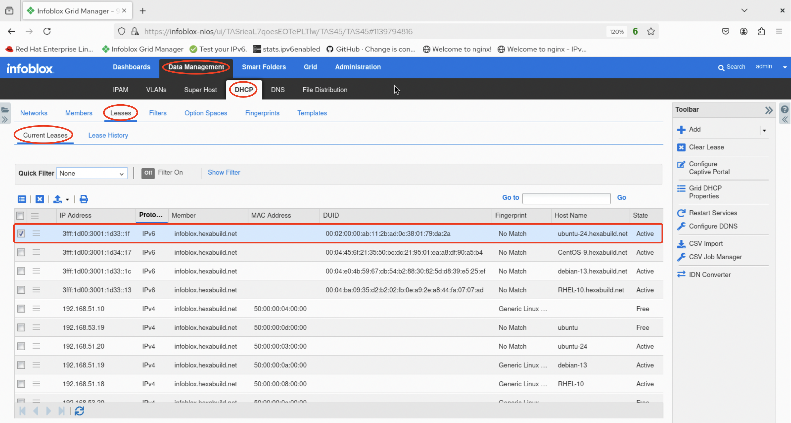
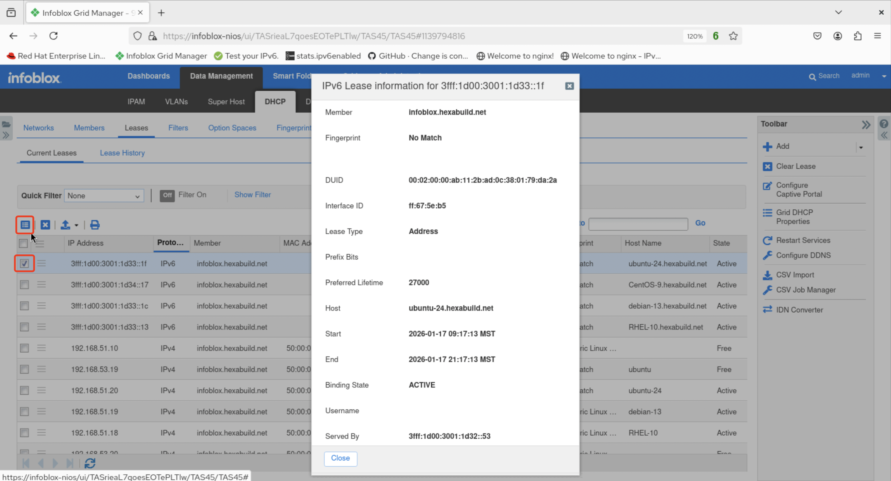

# Infoblox Demo 9

## Configure a DHCPv6 Range

1. After logging in to the GUI, navigate to *Data Management -> DHCP -> Networks* then click on the IPv6 network prefix the DHCPv6 range will be added to (in this example `3fff:1d00:3001:1d34::/64`).


2. The next screen shows the selected IPv6 prefix. To configure a range, click the triangle next to the plus icon and select **Range**.


3. The **Add IPv6 Range Wizard > Step 1 of 5** screen appears. Select **Add IPv6 Range** then click **Next**.
 


4. For the **Add IPv6 Range Wizard > Step 2 of 5** screen, the IPv6 prefix has already been selected. **Specify Range by** should indicate **Address** and the **Start Address** and **End Address** fields are pre-populated with the /64 prefix. Add the starting and ending addresses for the range (in this example, `3fff:1d00:3001:1d34::10` through `3fff:1d00:3001:1d34::1f`) then click **Next**. 
 


5. For **Step 3 of 5** in the wizard, the **Served by** field should be configured to select the **Grid Member** name from the pull-down menu (in this instance, `infoblox.hexabuild.net`). Click **Save & Close**. 
 


6. Restart the service.


7. The newly-added DHCPv6 range can be validated as properly configured by checking an IPv6 node on the segment configured with the IPv6 prefix the DHCPv6 range is in. In this example, a Ubuntu-24 server has received the DHCPv6 address `3fff:1d00:3001:1d34::1f/128`. The IID of `::1f` falling within the configured DHCPv6 range along with the /128 CIDR length both indicate that the assignment is via DHCPv6.

```console
user@ubuntu-24:~$ ip -6 address show dev ens3
2: ens3: <BROADCAST,MULTICAST,UP,LOWER_UP> mtu 1500 qdisc pfifo_fast state UP group default qlen 1000
    altname enp0s3
    inet6 3fff:1d00:3001:1d33::1f/128 scope global dynamic noprefixroute
       valid_lft 27908sec preferred_lft 11708sec
    inet6 3fff:1d00:3001:1d33:5200:ff:fe03:0/64 scope global dynamic mngtmpaddr noprefixroute
       valid_lft 2591713sec preferred_lft 14113sec
    inet6 fe80::5200:ff:fe03:0/64 scope link
       valid_lft forever preferred_lft forever
user@ubuntu-24:~$
```

8. Additional verification can be accomplished via the NIOS web UI. Navigate to *Data Management -> DHCP -> Leases -> Current Leases* to view the existing/new DHCPv6 leases. In this example, the lease for `3fff:1d00:3001:1d34::1f` is shown along with the additional lease information.



9. For more detail, select the desired lease and click on the *Lease Details* icon. The resulting screen provides additional information for the selected lease.


