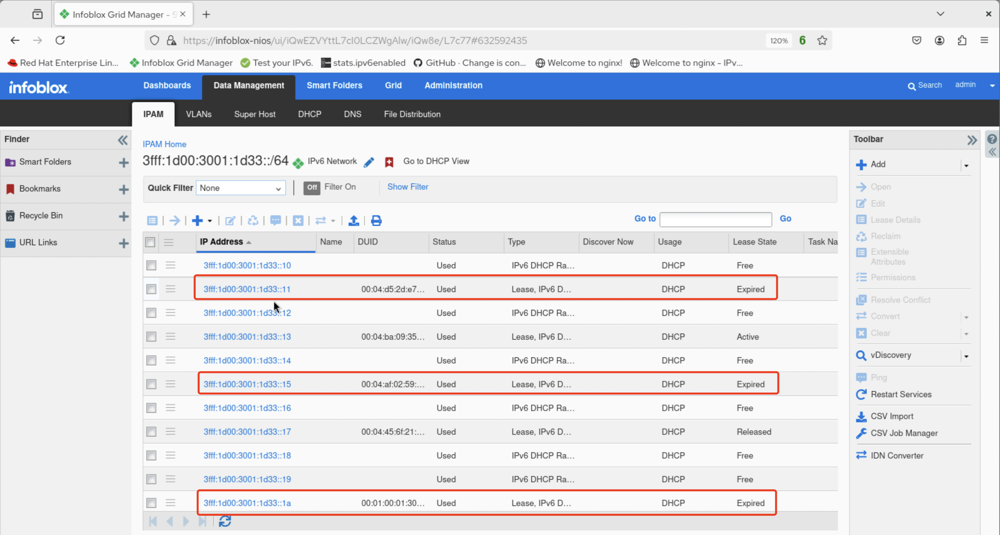
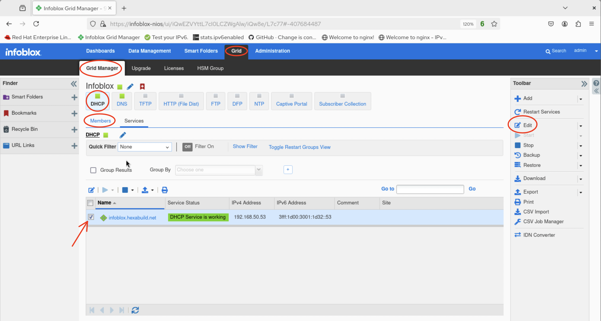
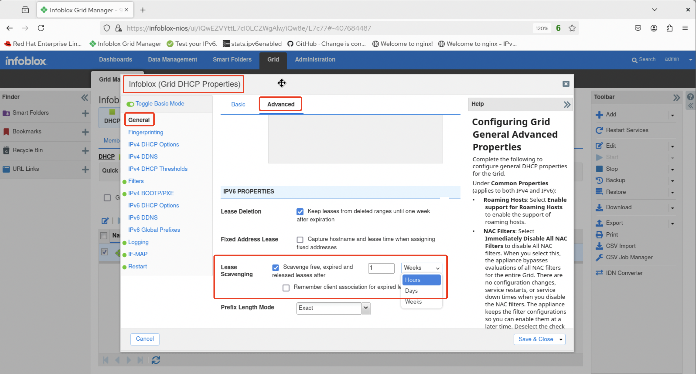

# Linux Demo 10

## Enabling DHCP(v6) lease scavenging

> Free and backup DHCP and DHCPv6 leases will remain in the database unless **lease scavenging** is enabled. It is disabled by default but can be activated for DHCP and DHCPv6 selectively as desired.

1. After logging in to the UI, view expired leases by navigating from the dashboard to *Data Management -> IPAM* then clicking on an IPv6 prefix that has been configured for DHCPv6.

2. Observe the list of available and expired leases for the prefix.

3. Next, navigate to *Grid -> Grid Management -> DHCP -> Members*, click the checkbox to select the grid member then select **Edit** in the toolbar.

4. Verify that the configuration screen is for Infoblox (Grid DHCP Properties) then make sure *General* and *Advanced* are selected. Scroll down to *IPv6 Properties* and choose the lease scavenging duration (minimum of 6 hours) that fits the overall DHCPv6 operational model.

5. Click **Save & Close** and restart the service. Leases will now be scavenged according to the configured settings.

 
