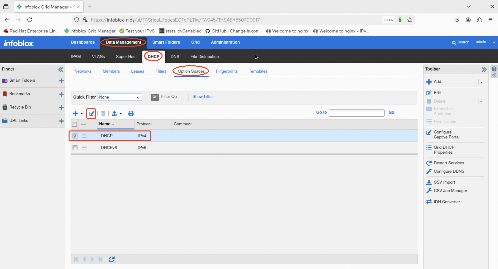
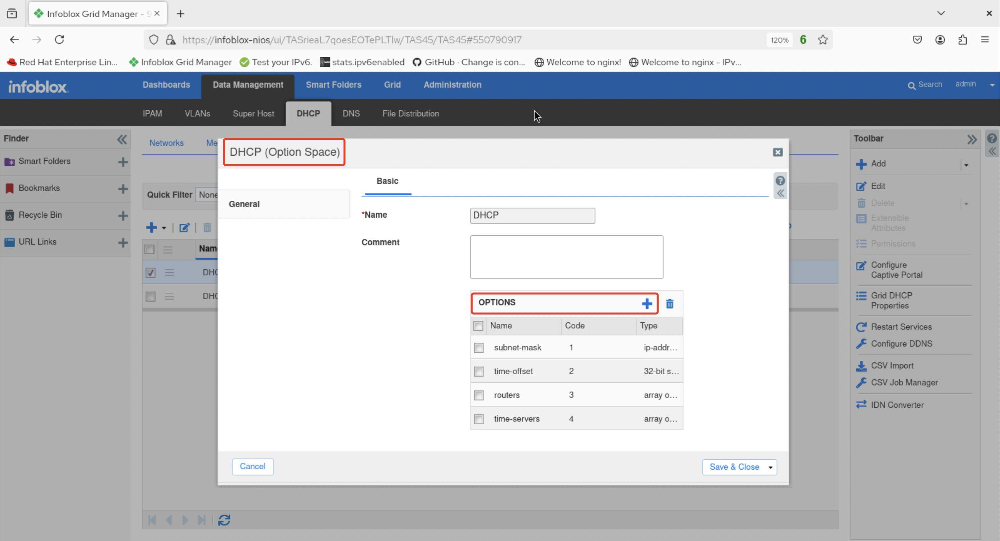
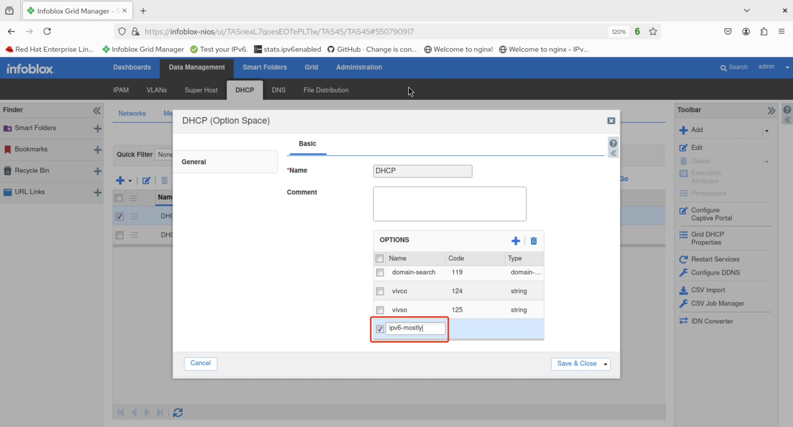
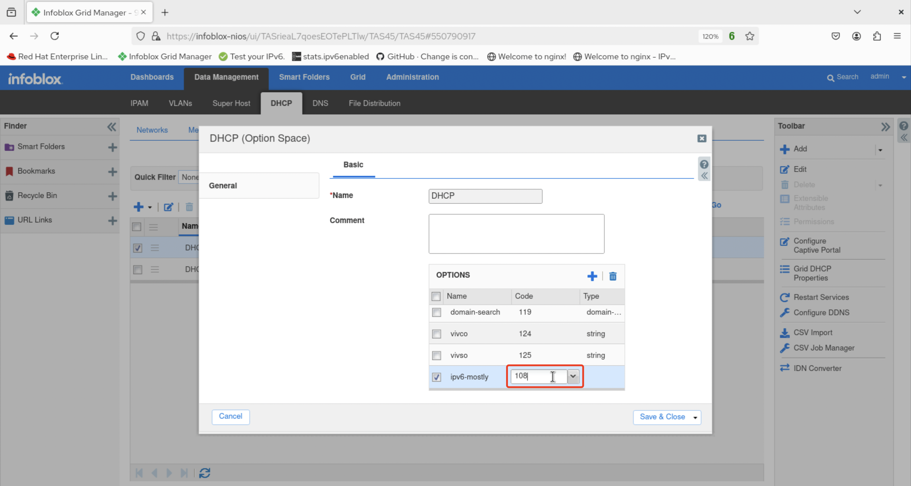
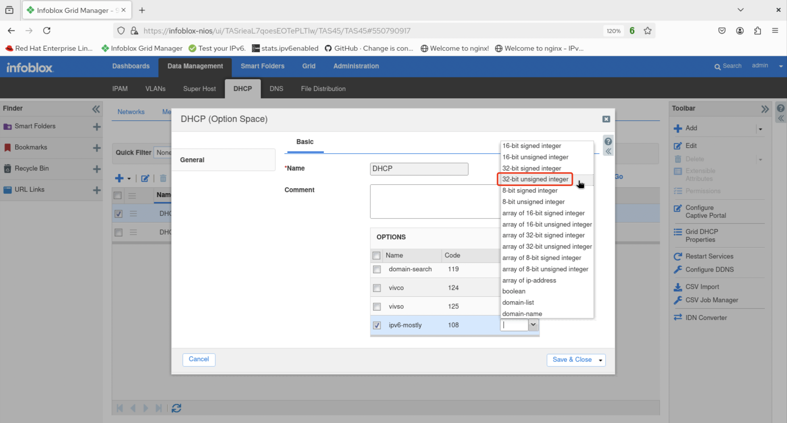
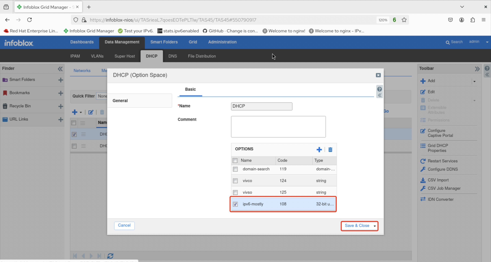
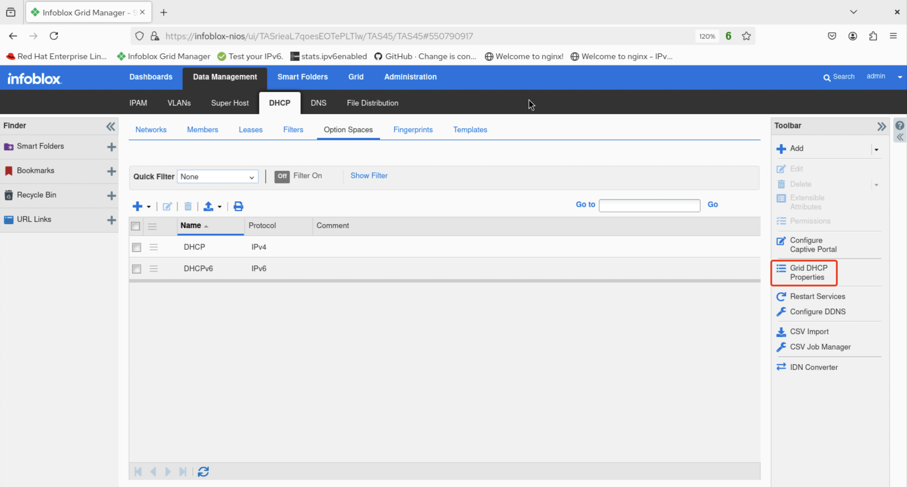
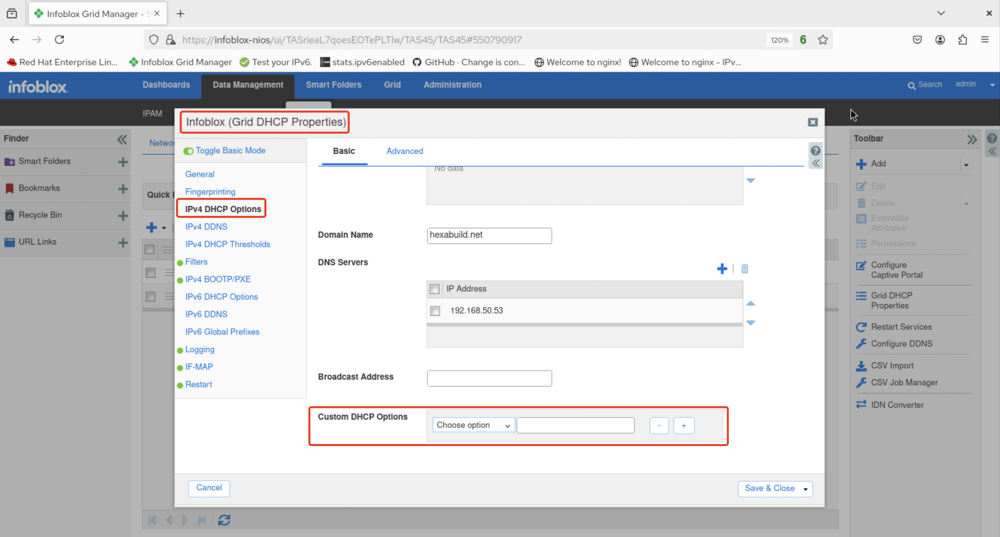
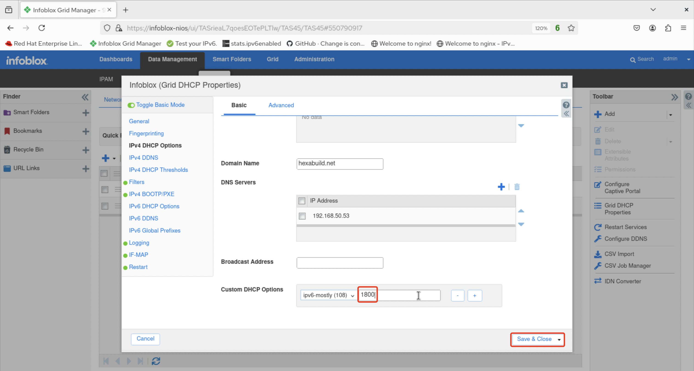
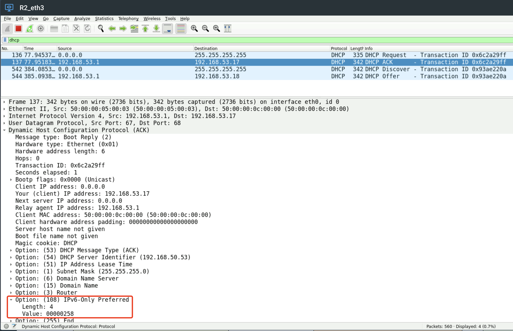

# Linux Demo 11

## Configuring DHCP Option 108 to Support IPv6-Mostly

1. After logging in to the UI, navigate to *Data Management -> DHCP -> DHCP Options* then select the checkbox for **DHCP** and click the pencil/edit icon.

2. The **DHCP (Option Space)** configuration panel appears. Click the plus sign next to options to add a new DHCP option.

3. Scroll to the bottom of the list of options where a new blank one should appear. Click in the area under the **Name** column heading and enter a descriptive name. In this example, *ipv6-mostly* is entered.

4. Next, click in the area under the **Code** column heading and enter a value. In this example, *108* for DHCP Option 108.

5. Next, click in the area under the **Type** column heading and select a value from the pull-down menu. In this example, *32-bit Unsigned Integer* is selected

6. Verify that the new option has all the correct values then click **Save & Close**.

7. Next click on **Grid DHCP Properties** in the toolbar.
   

8. On the **(Infoblox) Grid DHCP Properties** configuration panel that appears, select **IPv4 DHCP Options** in the left column, then scroll down to the **Custom DHCP Options** item.
   

9. Click the **Custom DHCP Options** pull-down menu and select the desired option. In this example, *ipv6-mostly (108) 32-bit unsigned integer*.
   

10. The second field for **Custom DHCP Options** accepts a value associated with the configured option type. In this example, this is the number of seconds (1800 seconds, or 30 minutes) that DHCP will signal to the IPv6-mostly host not to configure an IPv4 lease. Click **Save & Close** and restart the service.
   

11. The proper configuration of the new DHCP option can be validated in different ways. In this example, a Wireshark packet capture of DHCP traffic to an IPv6-mostly host indicates the presence of DHCP Option 108 in the ACK from the DHCP server.

