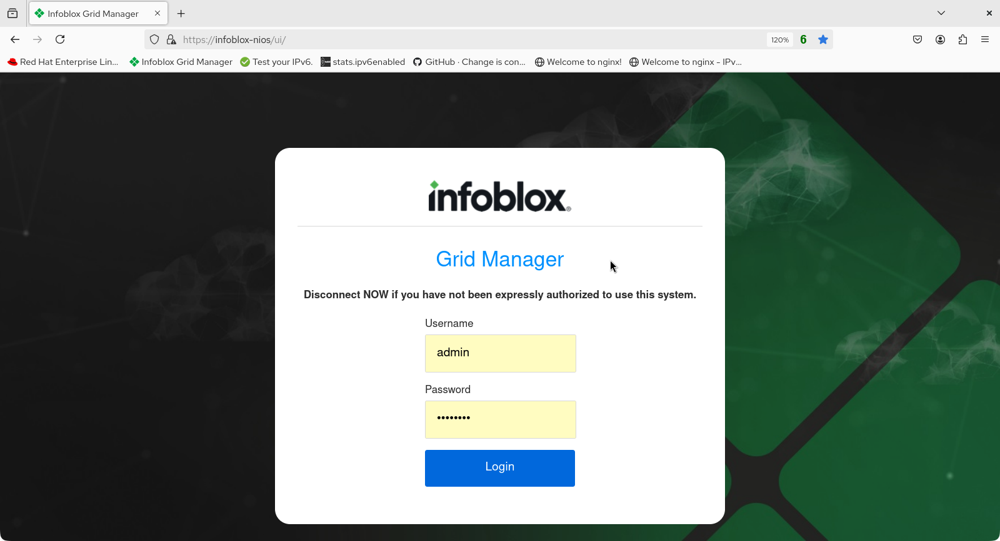
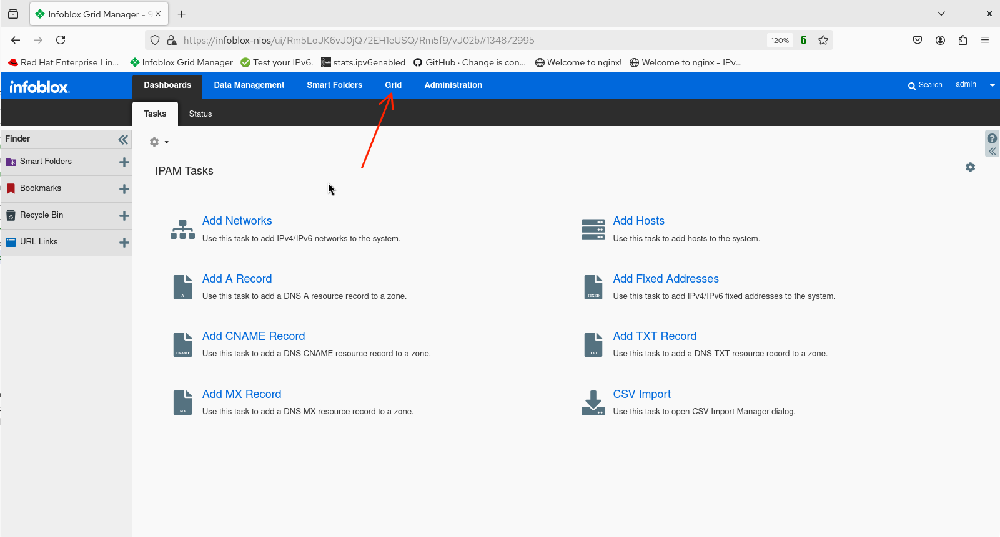
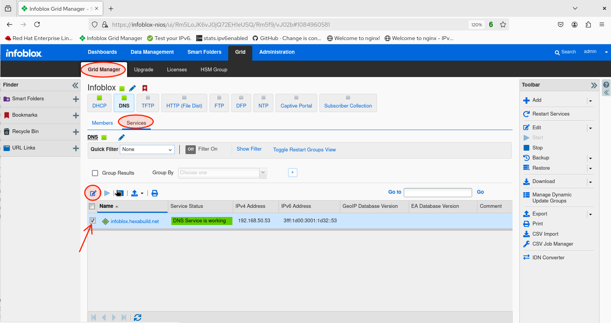
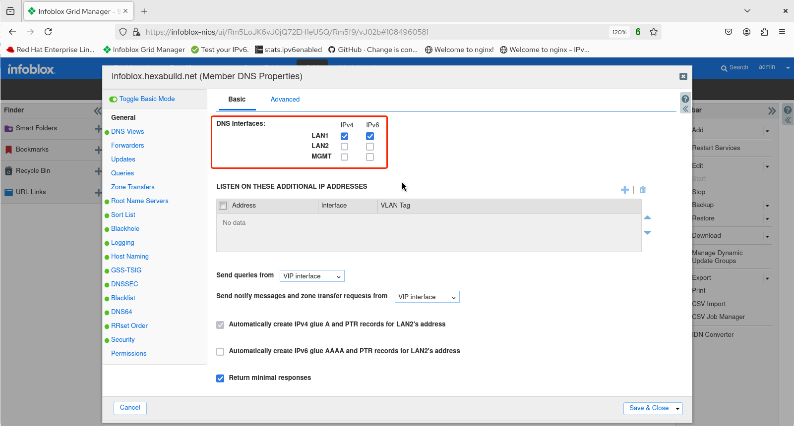
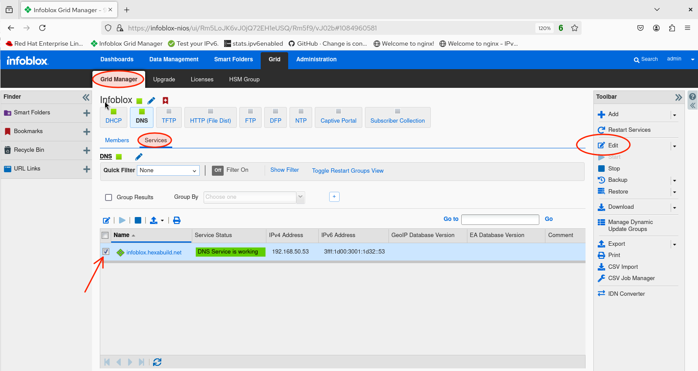
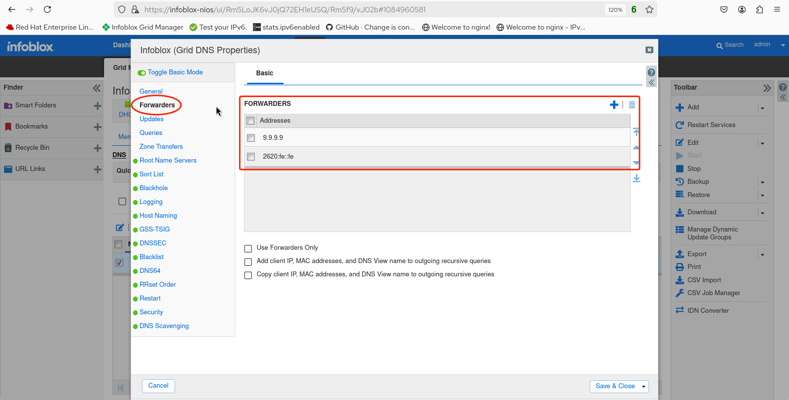
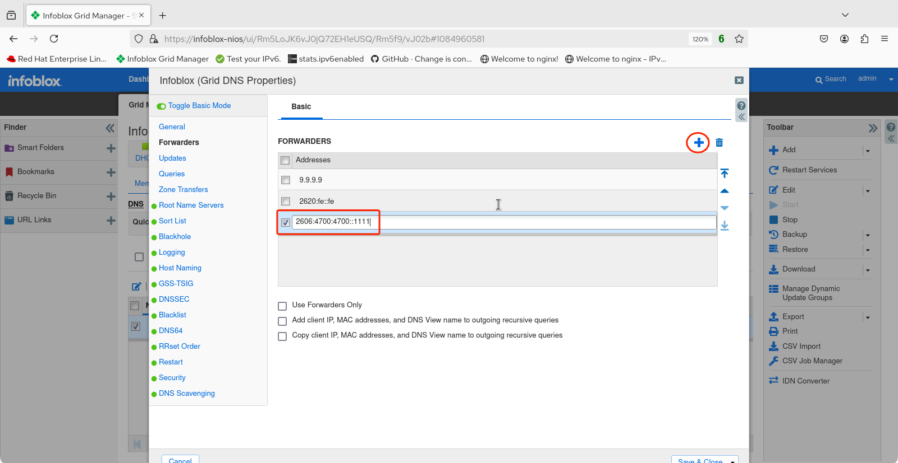
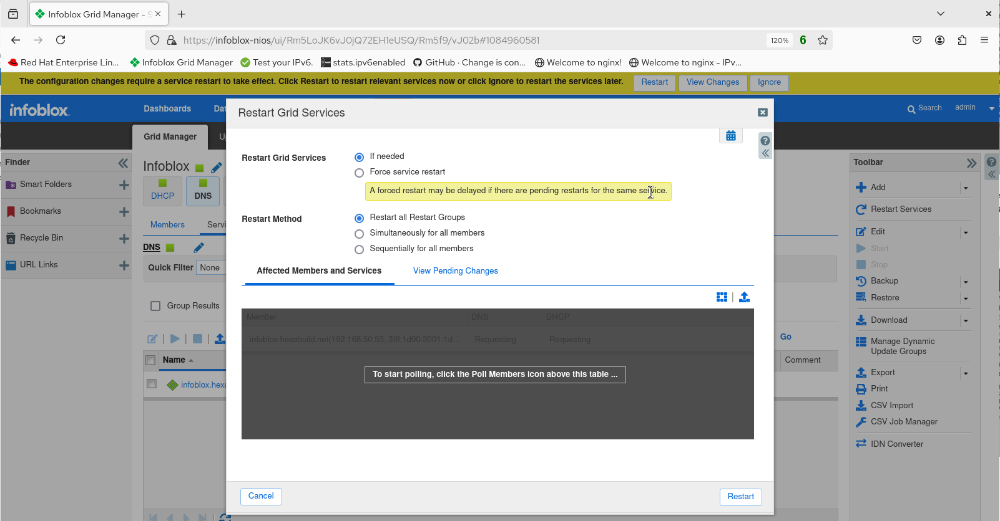

# Infoblox Demo 4

## IPv6 Basic DNS Configuration in Infoblox NIOS 

1. Login to the web UI. 

2. Select **Grid**.

3. The **Grid Manager** workspace appears. Verify that the **Services** tab is selected then check the box next to the grid member's name before clicking on the edit button.

4. The **Member DNS Properties** screen appears. Verify that IPv6 (along with IPv4) is enabled for the LAN1 interface.

   > In this lab example, the Infoblox nameserver is authoritative for only the hexabuild.net domain (and only within the confines of the lab network). The servers and clients are configured to use IPv4 and IPv6 addresses of infoblox.hexabuild.net as the only recursive DNS server. As a result, the nameserver needs to have forwarders configured to facilitate name resolution for Internet domain names.

5. To configure DNS forwarders, return to the *Grid -> Grid Manager -> Services* screen, click the service checkbox, then click **Edit** in the Toolbar on the right.

6. Note that two Internet-based external forwarders are already configured (provided by the open DNS service Quad9 in this instance).

7. To add an additional forwarder, click the plus sign in the uppper right hand corner, then enter the IPv6 (or IPv4) address of the forwarder in the indicated field. (In this example, the IPv6 address for a Cloudflare DNS nameserver is used.) Click **Save & Close**.

8. Restart the service.

