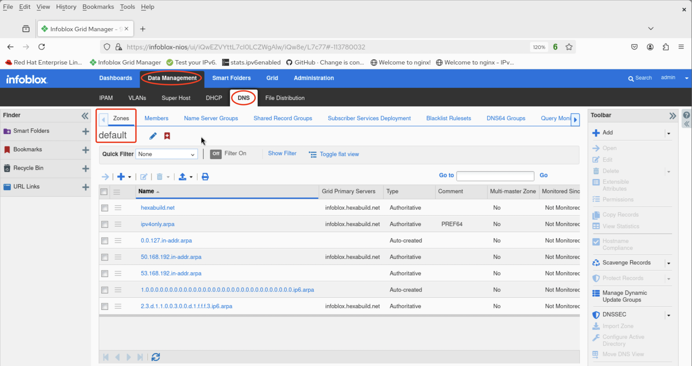
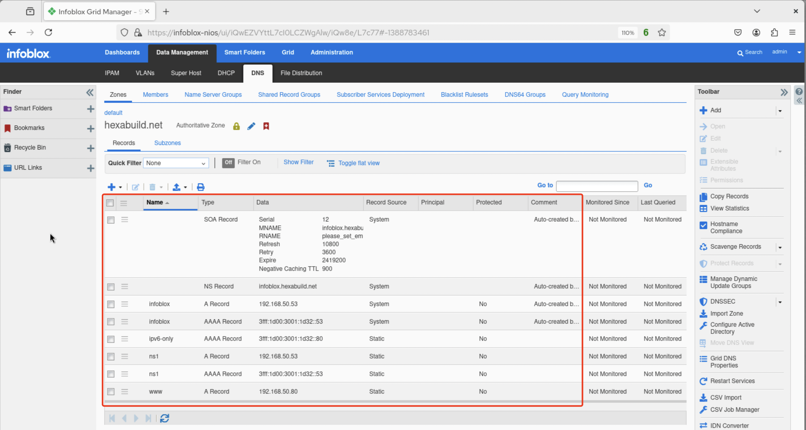
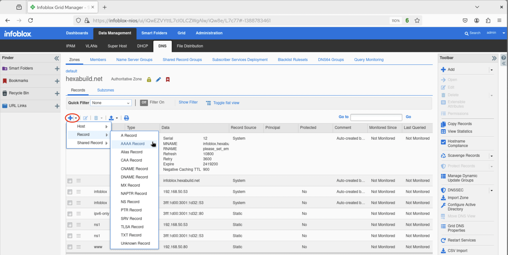
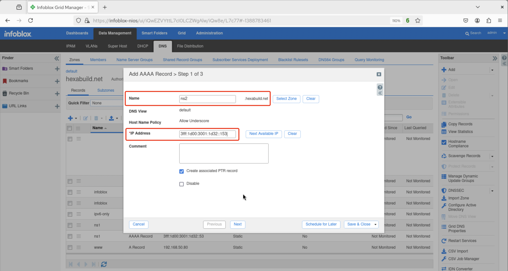
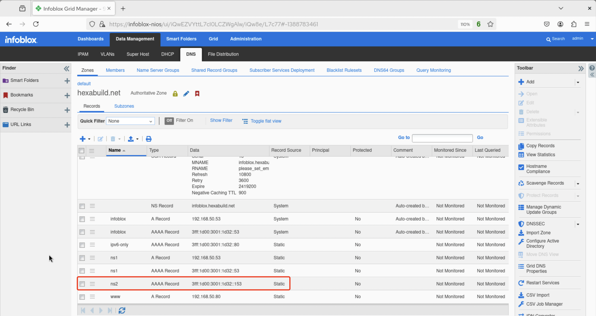
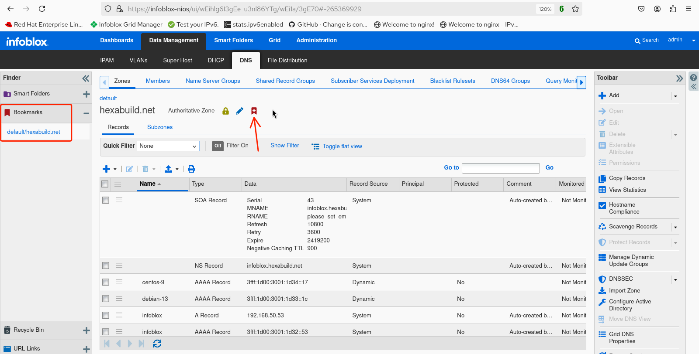

# Infoblox Demo 5

## Adding IPv6 DNS Resource Records in Infoblox NIOS 

1. Login to the web UI. 


2. Navigate to *Data Management -> DNS -> Zones (default)* and observe the configured zones.



3. Select a zone to add resource records to. In this example, the authoritative **hexabuild.net** zone is selected by clicking on the hexabuild.net link from the list of zones.


4. Observe the list of resource records of differing types for the selected zone. Note that forward mapping zones can contain both A (IPv4) and AAAA (IPv6) records.



5. To add a resource record, click on the triangle next to the plus icon and select the record type to be added. For this example, an additional AAAA record will be added to map the secondary DNS nameserver `ns2.hexabuild.net` to the IPv6 address of `3fff:1d00:3001:1d32::153`



6. Populate the *Name* and *IPv6 Address* fields with the desired values then click *Save & Close* 



7. Verify that the new AAAA record for the hostname `ns2` appears in the records list along with the proper IPv6 address.



8. (Optional) Create a bookmark in the Finder bar on the left side of the screen to be able to quickly navigate back to the **hexabuild.net** foward zone for future additions or changes.




9. The new AAAA record can also be validated by using the `dig` command on one of the host nodes.

```console
user@ubuntu-24:~$ dig AAAA ns2.hexabuild.net @ns1.hexabuild.net

; <<>> DiG 9.18.39-0ubuntu0.24.04.2-Ubuntu <<>> AAAA ns2.hexabuild.net @ns1.hexabuild.net
;; global options: +cmd
;; Got answer:
;; ->>HEADER<<- opcode: QUERY, status: NOERROR, id: 37611
;; flags: qr aa rd ra; QUERY: 1, ANSWER: 1, AUTHORITY: 0, ADDITIONAL: 1

;; OPT PSEUDOSECTION:
; EDNS: version: 0, flags:; udp: 1220
; COOKIE: 7379e94d1a4c6d3201000000696444bdfc2211f27caf036c (good)
;; QUESTION SECTION:
;ns2.hexabuild.net.		IN	AAAA

;; ANSWER SECTION:
ns2.hexabuild.net.	28800	IN	AAAA	3fff:1d00:3001:1d32::153

;; Query time: 1 msec
;; SERVER: 3fff:1d00:3001:1d32::53#53(ns1.hexabuild.net) (UDP)
;; WHEN: Mon Jan 12 00:47:59 UTC 2026
;; MSG SIZE  rcvd: 102
```` 