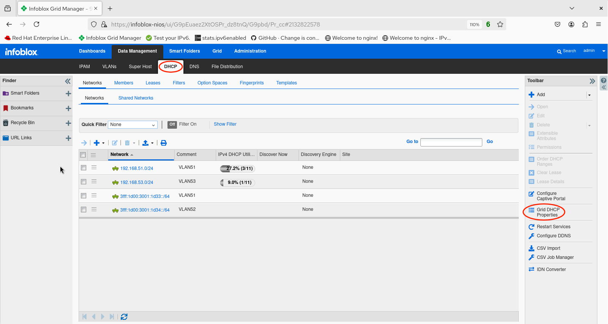
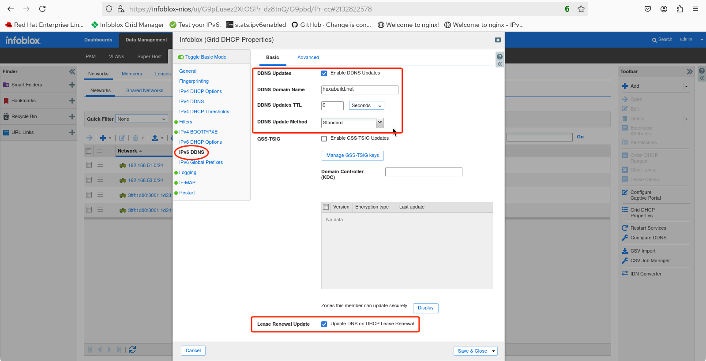
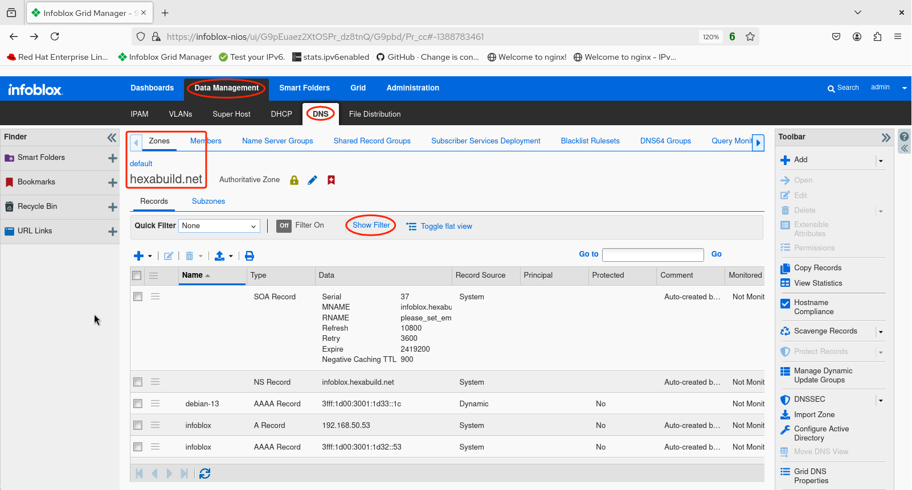
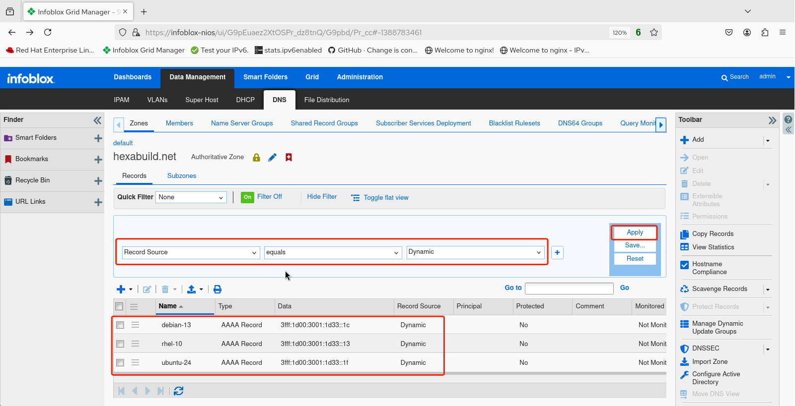

# Linux Demo 6

## Enabling IPv6 DDNS

1. Login to the web UI. 

2. Navigate to *Data Management -> DNS -> Zones (default)* and observe the configured zones.

3. Select the zone that DDNS updates will apply to. In this example, the authoritative **hexabuild.net** zone is selected by clicking on the hexabuild.net link from the list of zones.

4. Observe the list of resource records of differing types for the selected zone. Note that none of the records are marked *Dynamic*, indicating that DDNS is likely not enabled for either IPv6 or IPv4.

5. Navigate to the *DHCP* tab under *Data Management* and click *Grid DHCP Properties* in the toolbar.

6. On the *Grid DHCP Properties* panel that appears, select *IPv6 DDNS* from the left-hand column. Next, check the box to enable *DDNS Updates* and enter the *DDNS Domain Name* (in this example, **hexabuild.net**). Change the *DDNS Update Method* to **Standard** and near the bottom check the *Lease Renewal Update* box. Click **Save & Close**.

7. Restart the service.

8. Once there are new leases or the existing leases have renewed, return to *Data Management -> DNS -> Zones (default) hexabuild.net* and click on **Show Filter**.

9. Configure the filter by choosing *Record Source* for the first field. The operator should be *equals*, then select *Dynamic* for the third field. Click **Apply** then observe the three IPv6 leases below for which DNS has been dynamically updated with learned hostnames for the hexabuild.net forward zone.

