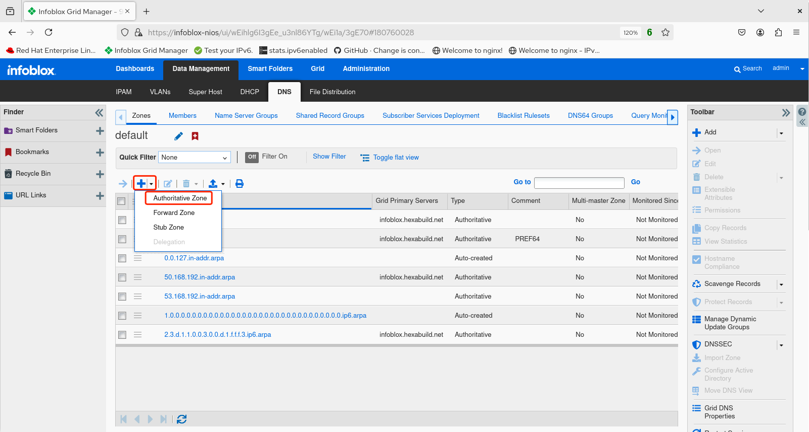
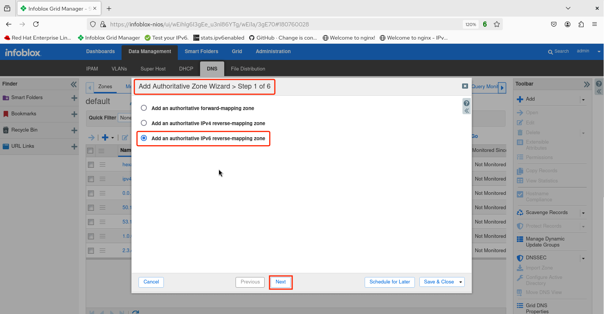
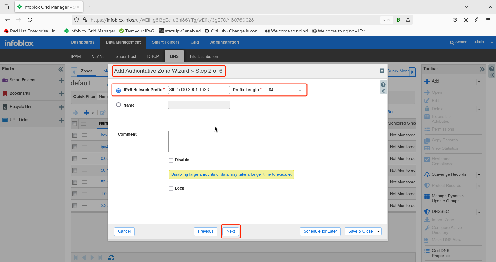
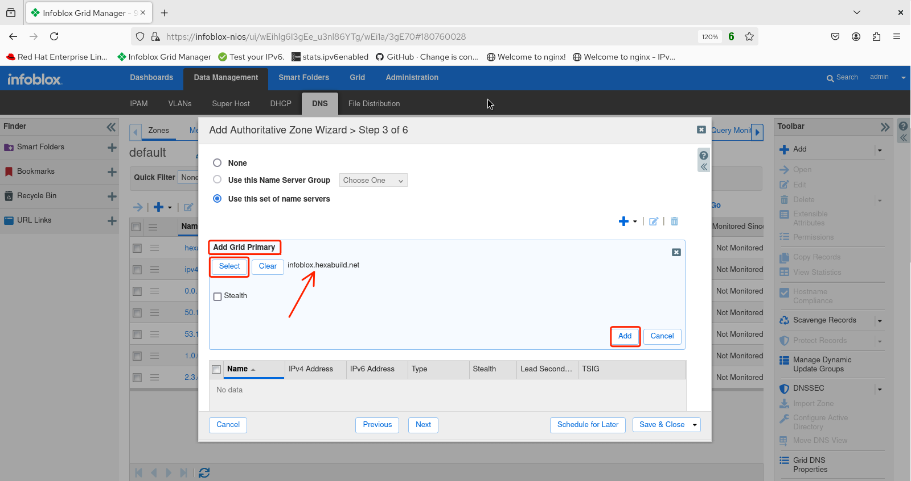
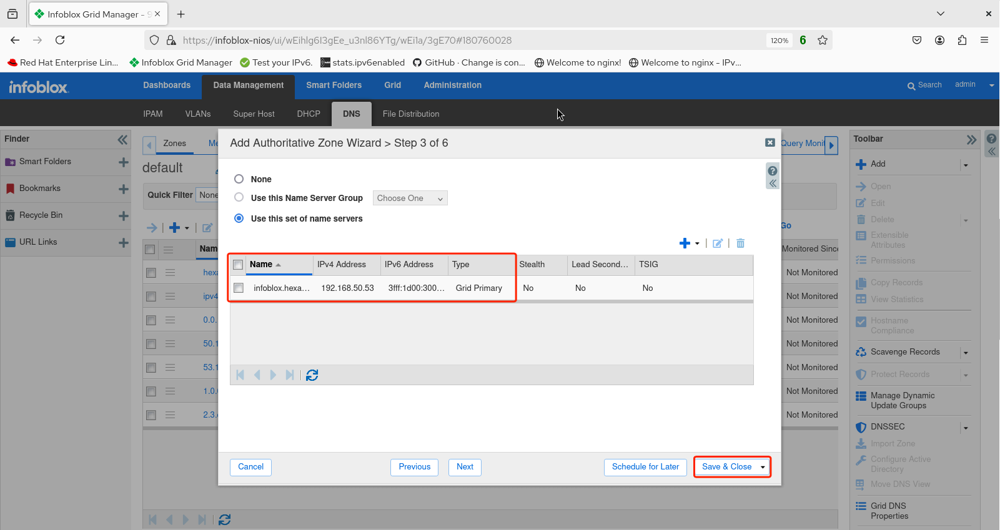
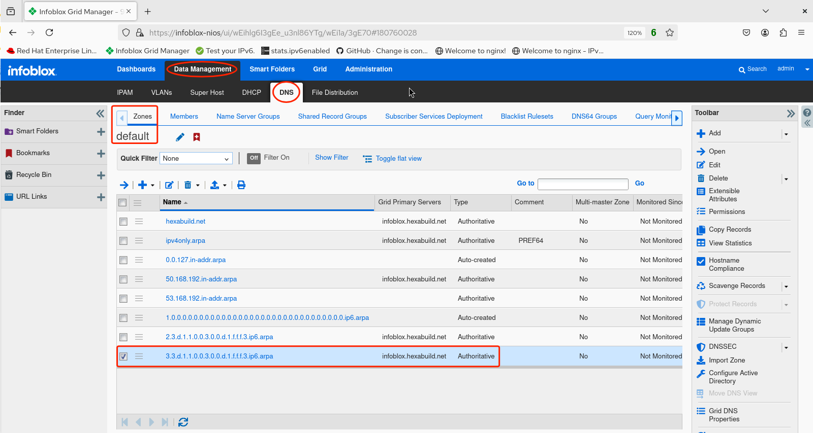
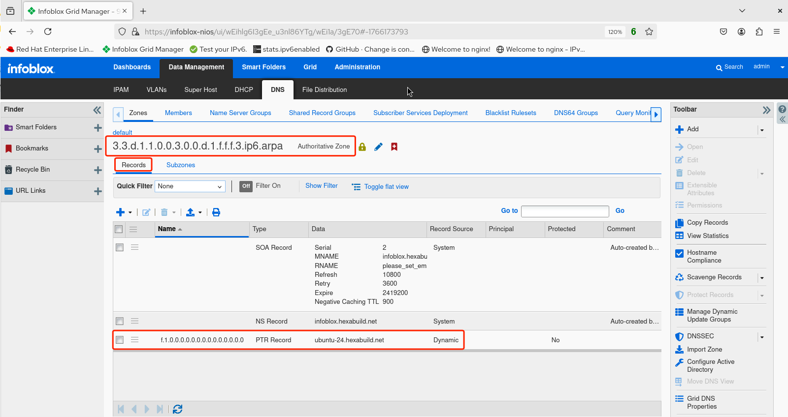

# Infoblox Demo 7

## Adding an IPv6 DNS Authoritative Reverse Zone 

1. After logging in to the GUI, navigate to *Data Management -> DNS -> Zones (default)* and observe the configured zones.


2. Click on the triangle next to the plus icon and select *Authoritative Zone*.



3. The **Add Authoritative Zone Wizard > Step 1 of 6** screen appears. Select *Add an authoritative reverse-mapping zone* then click **Next**.



4. The **Add Authoritative Zone Wizard > Step 2 of 6** screen appears. In the *IPv6 Network Prefix* field, enter the prefix and length of the desired reverse zone. In this instance, `3fff:1d00:3001:1d33::/64` is added. Click **Next**.



5. The **Add Authoritative Zone Wizard > Step 3 of 6** screen appears. Select *Use this set of name servers* then click the triangle next to the plus icon and select *Grid Primary*. 


6. The **Add Grid Primary** screen appears. Click **Select**. The name of the Grid Primary appears (*infoblox.hexabuild.net*). Click **Add**.



7. Verify that the Grid Primary name server name and address have been added, then click **Save & Close**. 



8. Restart the service.


9.  From the *Data Management -> DNS -> Zones (Default)* screen, observe the newly added authoritative reverse zone for `3fff:1d00:3001:1d33::/64` which appears as `3.3.d.1.1.0.0.3.0.0.d.1.f.f.f.3.ipv6.arpa`. Note that NIOS has done the tricky work of reversing the prefix characters to properly name the reverse mapping zone. Click on the link to the zone to open it.



10.  The reverse zone records for `3.3.d.1.1.0.0.3.0.0.d.1.f.f.f.3.ipv6.arpa` are displayed. In this example, a reverse pointer record (PTR) is shown for the dynamically learned host `ubuntu-24` mapped to `f.1.0.0.0.0.0.0.0.0.0.0.0.0.0.0` for the lower 64 bits of the address derived from the IPv6 prefix. 



11.  For additional verification of the new zone and any reverse records, use the `dig -x` command and argument. For example, `dig -x 3fff:1d00:3001:1d33::1f @infoblox.hexabuild.net`.

```console
user@debian-13:~$ dig -x 3fff:1d00:3001:1d33::1f @infoblox.hexabuild.net

; <<>> DiG 9.20.15-1~deb13u1-Debian <<>> -x 3fff:1d00:3001:1d33::1f @infoblox.hexabuild.net
;; global options: +cmd
;; Got answer:
;; ->>HEADER<<- opcode: QUERY, status: NOERROR, id: 54344
;; flags: qr aa rd ra; QUERY: 1, ANSWER: 1, AUTHORITY: 0, ADDITIONAL: 1

;; OPT PSEUDOSECTION:
; EDNS: version: 0, flags:; udp: 1220
; COOKIE: 436372e0ba568b4801000000696694302ba1629bf20f5676 (good)
;; QUESTION SECTION:
;f.1.0.0.0.0.0.0.0.0.0.0.0.0.0.0.3.3.d.1.1.0.0.3.0.0.d.1.f.f.f.3.ip6.arpa. IN PTR

;; ANSWER SECTION:
f.1.0.0.0.0.0.0.0.0.0.0.0.0.0.0.3.3.d.1.1.0.0.3.0.0.d.1.f.f.f.3.ip6.arpa. 3600 IN PTR ubuntu-24.hexabuild.net.

;; Query time: 0 msec
;; SERVER: 3fff:1d00:3001:1d32::53#53(infoblox.hexabuild.net) (UDP)
;; WHEN: Tue Jan 13 11:51:30 MST 2026
;; MSG SIZE  rcvd: 166
```
