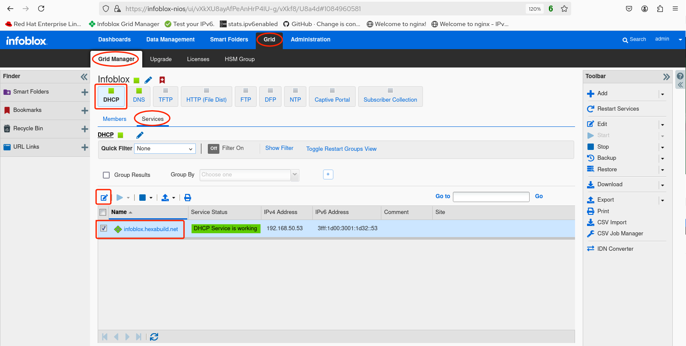
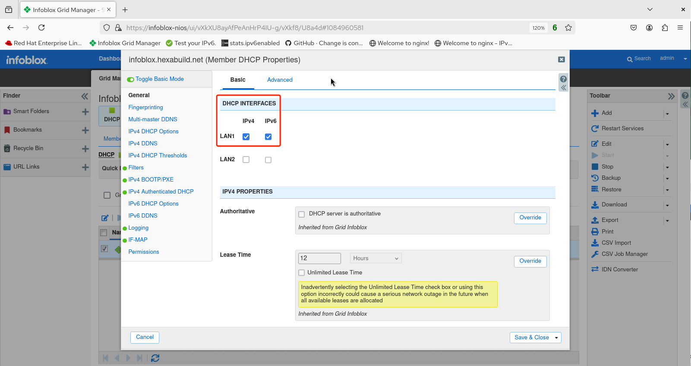

# Infoblox Demo 8

## Basic DHCPv6 Configuration

1. Login to the web UI. 

2. Select **Grid**.

3. Select **Grid Manager**, make sure **DHCP** is selected and under **Services** check the box next to the grid member name (in this example `infoblox.hexabuild.net`). Click on the pencil icon to edit the DHCP settings.

4. The **Member DHCP Properties** screen appears. Verify that on the **General** tab, IPv6 (along with IPv4) is enabled for the LAN1 interface.

5. If any changes were made, click **Save & Close**.