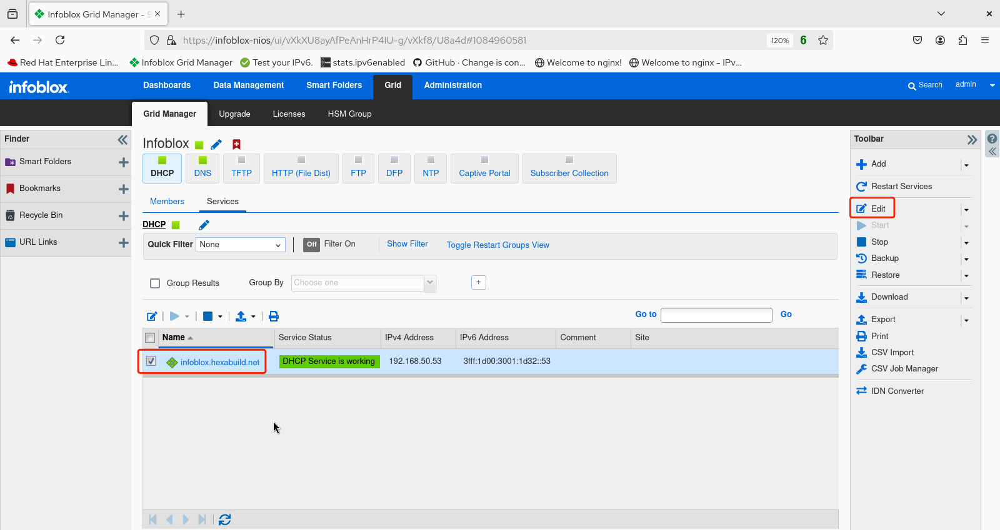
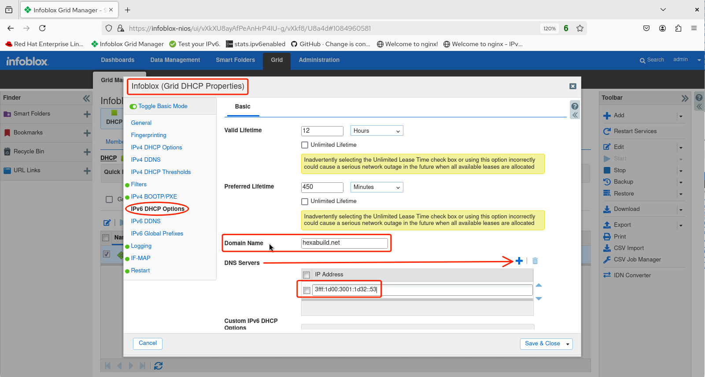

# Infoblox Demo 8

## DHCPv6 Configuration

1. After logging in to the GUI, select **Grid**.

2. Select **Grid Manager**, make sure **DHCP** is selected and under **Services** check the box next to the grid member name (in this example `infoblox.hexabuild.net`). Click on the pencil icon to edit the DHCP settings.

3. The **Member DHCP Properties** screen appears. Verify that on the **General** tab, IPv6 (along with IPv4) is enabled for the LAN1 interface.

4. If any changes were made, click **Save & Close**.

5. With the check box next to the grid member name still checked, click on the **Edit** icon in the toolbar.

6. The **Grid DHCP Properties** window appears. Select **IPv6 DHCP Options** in the panel to the left. Under **Basic** settings, enter the desired **Domain Name** (in this example `hexabuild.net`) the click the plus icon next to **DNS Servers** and add the IPv6 address of the DNS server to be advertised to the DHCPv6 clients (in this example, this Infoblox instance at `3fff:1d00:3001:1d32::53`).

7. Click **Save & Close** and restart services if prompted.