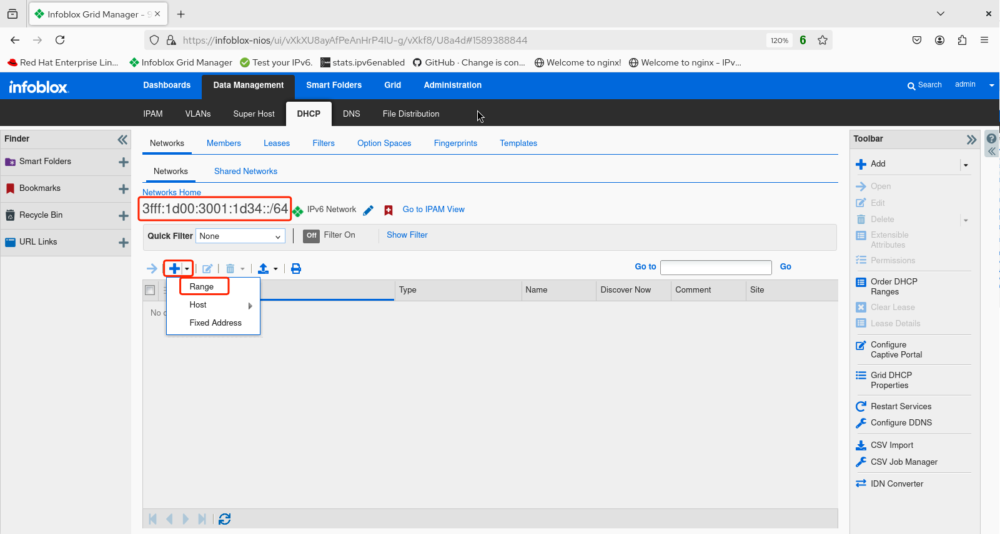
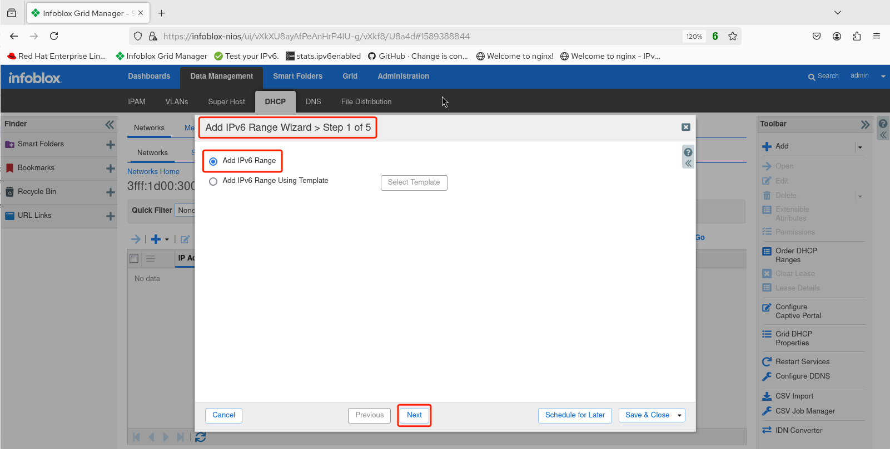
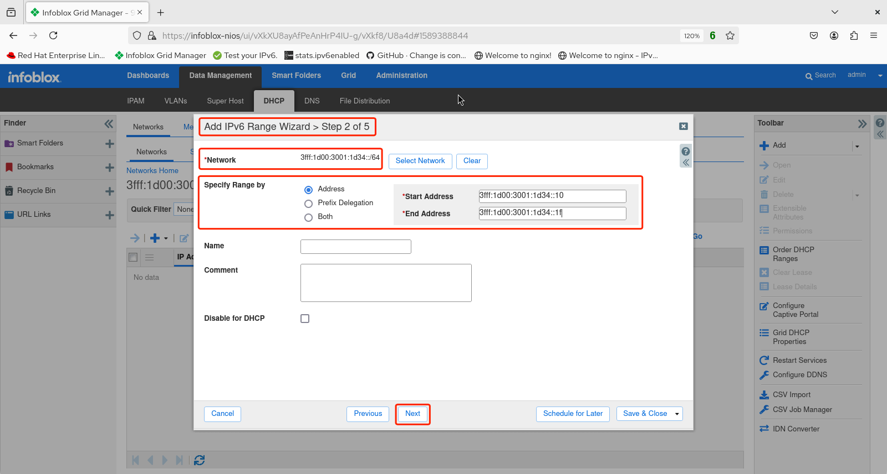
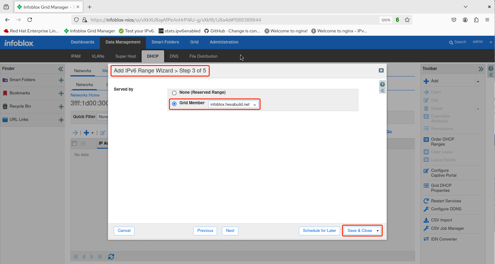

# Infoblox Demo 9

## Configure a DHCPv6 Range

1. After logging in to the GUI, navigate to *Data Management -> DHCP -> Networks* then click on the IPv6 network prefix the DHCPv6 range will be added to (in this example `3fff:1d00:3001:1d34::/64`).

2. The next screen shows the selected IPv6 prefix. To configure a range, click the triangle next to the plus icon and select **Range**.

3. The **Add IPv6 Range Wizard > Step 1 of 5** screen appears. Select **Add IPv6 Range** then click **Next**.
 

4. For the **Add IPv6 Range Wizard > Step 2 of 5** screen, the IPv6 prefix has already been selected. **Specify Range by** should indicate **Address** and the **Start Address** and **End Address** fields are pre-populated with the /64 prefix. Add the starting and ending addresses for the range (in this example, `3fff:1d00:3001:1d34::10` through `3fff:1d00:3001:1d34::1f`) then click **Next**. 
 

5. For **Step 3 of 5** in the wizard, the **Served by** field should be configured to select the **Grid Member** name from the pull-down menu (in this instance, `infoblox.hexabuild.net`). Click **Save & Close**. 
 

6. Restart the service.

