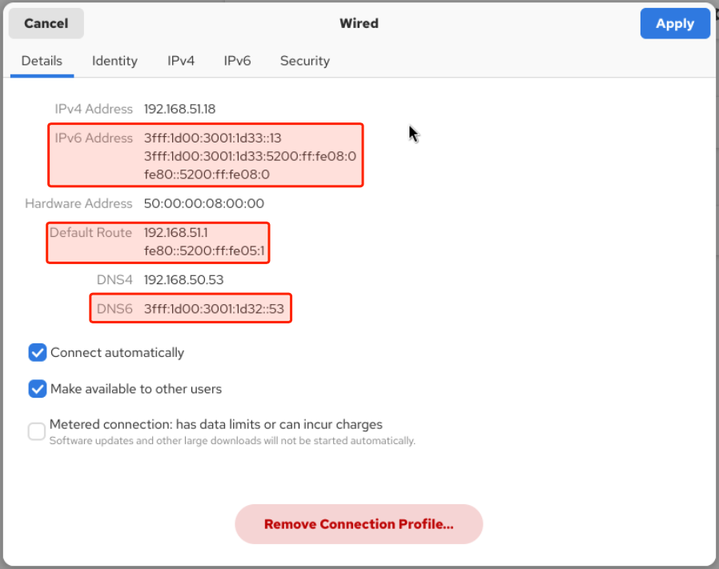

# Linux Demo 6

## Review IPv6 Configuration Options with a RHEL Desktop Instance 

1. Connect and login to the RHEL desktop.
2. Open the **Settings** application and select **Network**.
3. Click on the gear icon next to enable/disable slider for the primary interface and observe the IPv6 information on the **Details** tab. 
   - **IPv6 Address:** Inlcludes GUA, ULA, and link-local addresses
   - **IPv6 Default Route:** Link-local address of the gateway router
   - **DNS6:** IPv6 DNS nameserver(s)

*Settings -> Network -> Wired (gear icon) -> Details*

4. Select the **IPv6** tab.
5. Observe the available configuration options.
   - **IPv6 Method**
     - Automatic
     - Link-Local Only
     - Disable
     - Automatic, DHCP only
     - Manual
     - Shared to other devices
   - **DNS**
   - **Routes**   