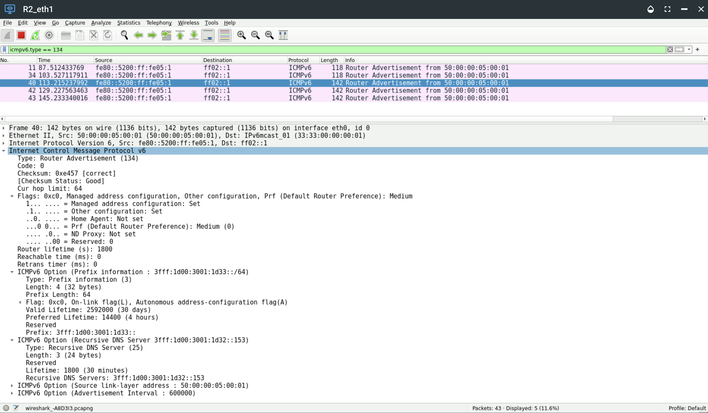

# Network Demo 2

## Router Interface RA Configuration

1. Login to router R2 with these credentials: \
    u: `vyos` \
    p: `vyos`

```console
R2 login: vyos
Password:
Welcome to VyOS!

   ┌── ┐
   . VyOS 2025.11.30-0023-rolling
   └ ──┘  current

 * Documentation:  https://docs.vyos.io/en/latest
 * Project news:   https://blog.vyos.io
 * Bug reports:    https://vyos.dev

You can change this banner using "set system login banner post-login" command.

VyOS is a free software distribution that includes multiple components,
you can check individual component licenses under /usr/share/doc/*/copyright

---
WARNING: This VyOS system is not a stable long-term support version and
         is not intended for production use.

vyos@R2:~$
```

2.  Enter configuration mode with the command `config` and view the router interfaces with the command `show interfaces`.

- How do the descriptions of the interfaces align with their address configurations?
- Compare the 3rd octet of the IPv4 address that matches the VLAN with the last two hexadecimal characters in the prefix before the IID, which doesn't. Or does it? ;)

```console
vyos@R2# sh interfaces
 ethernet eth0 {
     address 172.16.0.6/30
     address 2001:db8:0:2::b/64
     address 192.168.255.254/24
     description Link_to_R1/DMZ/Internet
     hw-id 50:00:00:05:00:00
 }
 ethernet eth1 {
     address 192.168.51.1/24
     address 3fff:1d00:3001:1d33::1/64
     description VLAN51_Dual-Stack
     hw-id 50:00:00:05:00:01
 }
 ethernet eth2 {
     address 3fff:1d00:3001:1d34::1/64
     description VLAN52_IPv6-Only
     hw-id 50:00:00:05:00:02
 }
 ethernet eth3 {
     address 192.168.53.1/24
     address 3fff:1d00:3001:1d35::1/64
     description VLAN53_IPv6-Mostly
     hw-id 50:00:00:05:00:03
 }
 loopback lo {
 }
[edit]
```

3. Next, run the command `show services router-advert`.
- How do the different RA settings differ between the interfaces and why?
- Which interfaces have SLAAC and DHCPv6 enabled (vs. DHCPv6 only)?

```console
vyos@R2# show service router-advert
 interface eth0 {
     no-send-advert
 }
 interface eth1 {
     managed-flag
     other-config-flag
     prefix 3fff:1d00:3001:1d33::/64 {
     }
 }
 interface eth2 {
     managed-flag
     other-config-flag
 }
 interface eth3 {
     name-server 3fff:1d00:3001:1d32::53
     nat64prefix 2001:db8:3001:1dff::/96 {
     }
     prefix 3fff:1d00:3001:1d35::/64 {
     }
 }
[edit]
vyos@R2#
```

4. The configuration for the dual-stack VLAN 51 Router Advertisement can be modified to include a nameserver address with the Vyos command `set service router-advert interface eth1 name-server <IPv6-address>`.

```console
vyos@R2# set service router-advert interface eth1 name-server 3fff:1d00:3001:1d32::153
[edit]
vyos@R2# commit
[edit]
vyos@R2#
```

5. With Wireshark capturing traffic on R2's eth1 interface (facing the VLAN51 dual-stack segment), a Router Advertisement containing the newly-configured recursive DNS server (RDNSS) IPv6 address can be observed.



6. Login to the Ubuntu-24 node in VLAN 51 and run the command `resolvectl` to view the DNS servers the node has configured. Note the presence of the address of the DNS server learned via SLAAC and RDNSS.

```console
user@ubuntu-24:~$ resolvectl
Global
         Protocols: -LLMNR -mDNS -DNSOverTLS DNSSEC=no/unsupported
  resolv.conf mode: stub

Link 2 (ens3)
    Current Scopes: DNS
         Protocols: +DefaultRoute -LLMNR -mDNS -DNSOverTLS DNSSEC=no/unsupported
Current DNS Server: 192.168.50.53
       DNS Servers: 192.168.50.53 3fff:1d00:3001:1d32::53 3fff:1d00:3001:1d32::153
        DNS Domain: hexabuild.net
user@ubuntu-24:~$
```