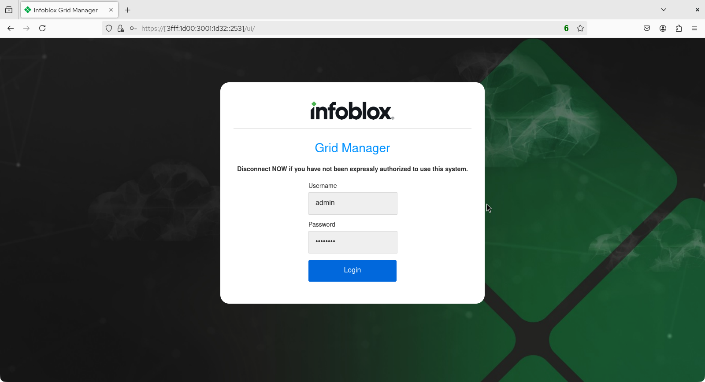
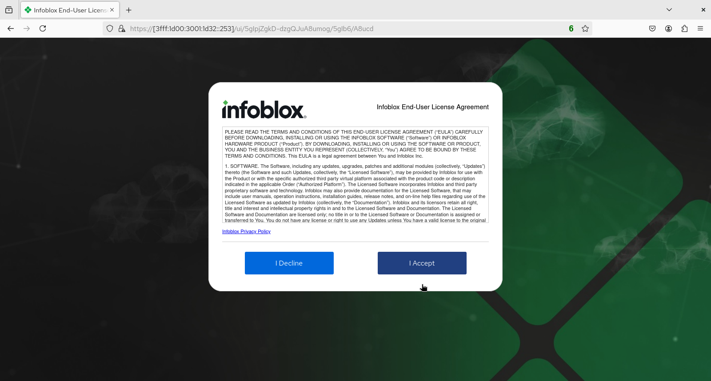
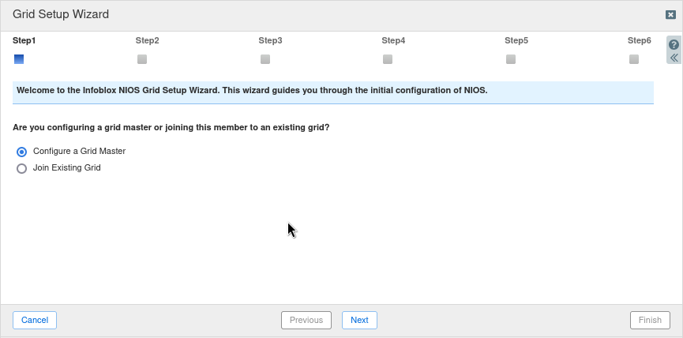

# Infoblox Demo

## Configure the basic settings for a new instance of Infoblox NIOS 

1. Power up a new, unconfigured instance of Infoblox NIOS. Once it has finished booting, login at the prompt with the username `admin` and the password `infoblox`

```console
Disconnect NOW if you have not been expressly authorized to use this system.
login: admin
Local password:

               Infoblox NIOS Release 9.0.3-50212-ee11d5834df9 (64bit)
     Copyright (c) 1999-2023 Infoblox Inc. All Rights Reserved.

                   type 'help' for more information


Infoblox >
```
2. Configure any necessary license information with the `set license` or `set temp_license` command. For this example using a virtual NIOS appliance, temporary 60-day licenses activated. 
3. Option 2 below is selected first (DNSOne with Grid (DNS, DHCP, Grid)).

```console
Infoblox > set temp_license

  1. DNSone (DNS, DHCP)
  2. DNSone with Grid (DNS, DHCP, Grid)
  3. Network Services for Voice (DHCP, Grid)
  4. Add NIOS License
  5. Add DNS Server license
  6. Add DHCP Server license
  ...<truncated>

Select license (1-18) or q to quit: 2

This action will generate a temporary 60-day DNSone with Grid license.
Are you sure you want to do this? (y or n): y
DNS temporary license installed.
DHCP temporary license installed.
Grid temporary license installed.

Temporary license is installed.

The UI needs to be restarted in order to reflect license changes.
Restart UI now, this will log out all UI users? (y or n):y

Are you sure you want to do this? (y or n): y
UI restarted.
```
4. Option 4 below is selected next (Add NIOS License) followed by option 5 (IB-V825)

```console
Infoblox > set temp_license

  1. DNSone (DNS, DHCP)
  2. DNSone with Grid (DNS, DHCP, Grid)
  3. Network Services for Voice (DHCP, Grid)
  4. Add NIOS License
  5. Add DNS Server license
  6. Add DHCP Server license
  ... <truncated>

Select license (1-18) or q to quit: 4

  1. CP-V805
  2. IB-V805
  3. ND-V805
  4. IB-V815
  5. IB-V825
  6. ND-V906
  ... <truncated>
Enter a number corresponding to a NIOS model (1 - 29) or q to quit: 5

This action will generate a temporary 60-day NIOS (Model IB-V825) license.

WARN: The product needs to be restarted in order to reflect this license change.

Are you sure you want to do this? (y or n): y
NIOS temporary license installed.

Temporary license is installed.

System will RESTART shortly. Wait for RESTART completion and perform the required additional configuration
```

5. Review the defaul network settings with the `show network` command.

```console
Infoblox > show network
Current LAN1 Network Settings:
  IPv4 Address:               192.168.1.2
  Network Mask:               255.255.255.0
  Gateway Address:            192.168.1.1
  VLAN Tag:                   Untagged
  HA enabled:                 false
  Grid Status:                Master of Infoblox Grid

Note: Additional addresses configured can be viewed through "show interface" command
```

6. Reconfigure the network settings with the `set network` command.

```console
Infoblox > set network
NOTICE: All HA configuration is performed from the GUI.  This interface is
        used only to configure a standalone node or to join a Grid.
Enter IP address: 192.168.50.253
Enter netmask [Default: 255.255.255.0]:
Enter gateway address [Default: 192.168.50.1]:
Enter VLAN tag [Default: Untagged]:
Configure IPv6 network settings? (y or n): y
Enter IPv6 address [Default: none]: 3fff:1d00:3001:1d32::253
Enter IPv6 Prefix Length [Default: none]: 64
Enter IPv6 gateway [Default: none]: automatic
Enter VLAN tag [Default: Untagged]:
Become grid member? (y or n): n

 New Network Settings:
  IPv4 address:         192.168.50.253
  IPv4 Netmask:         255.255.255.0
  IPv4 Gateway address: 192.168.50.1
  IPv4 VLAN tag:        Untagged

  IPv6 address:         3fff:1d00:3001:1d32::253/64
  IPv6 Gateway address: automatic
  IPv6 VLAN tag:        Untagged

 Old IPv4 Network Settings:
  IPv4 address:         192.168.1.2
  IPv4 Netmask:         255.255.255.0
  IPv4 Gateway address: 192.168.1.1
  IPv4 VLAN tag:        Untagged
        Is this correct? (y or n): y
        Are you sure? (y or n): y
Network settings have been updated.
[2026/01/08 22:32:36.854] System restart...
```
7. Once NIOS has restarted, login to the web UI to finish setting up the system. If you connect to the web UI via its IPv6 address don't forget to put the address in brackets! 



8. Accept the EULA by selecting 'I Accept'.



9. Complete the Grid Setup Wizard that appears after successful login. For the single lab/testing instance of vNIOS we are running, we choose the **Configure a Grid Master** option (then select **Next**).


