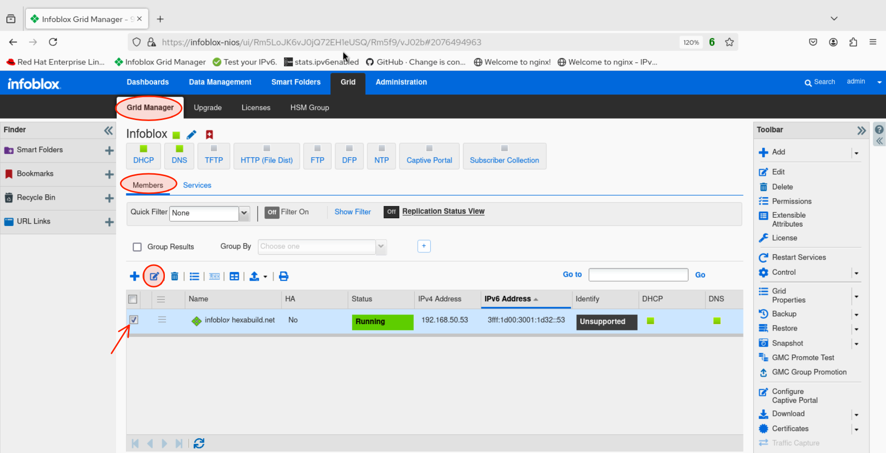
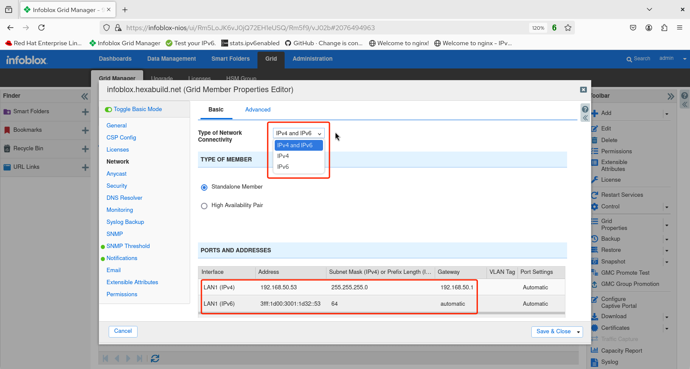

# Infoblox Demo

## Configuring network settings in the Infoblox NIOS GUI 

1. Login to the web UI. 

2. Select **Grid**

3. The **Grid Manager** workspace appears. Verify that the **Members** tab is selected then check the box next to the grid member's name before clicking on the edit button.  

4. The **Grid Member Properties Editor** screen appears. Select **Network** from the configuration tabs to the left.  

5. Observe the options for the type of network connectivity. In most deployments, **IPv4 and IPv6** will be the desired choice. Note also the existing IPv6 and IPv4 addressing and gateways from earlier, initial CLI configuration of NIOS.

